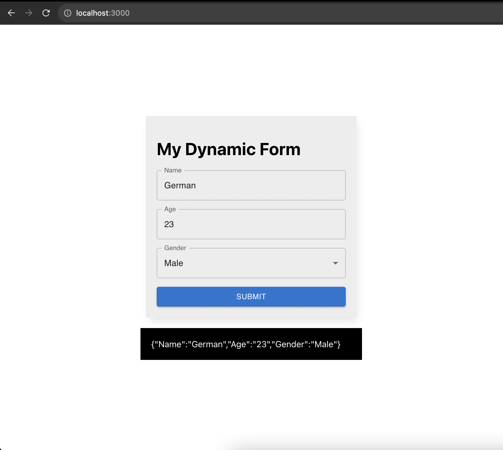

# Dynamic Form with React and Material-UI

This is a dynamic form program created with React and Material-UI. It allows the creation of a dynamic form with text input, number, and select fields. Additionally, it performs real-time validations and displays error messages if required fields are not completed. Besides that unit testing is addressed.

## Features

- Renders a dynamic form based on a provided field configuration.
- Supports text input, number, and select fields, more options config are available just ask, to have them.
- Performs real-time validations and displays error messages if required fields are empty.
- Displays captured data by the form upon submission.

## Technologies Used

- React
- TypeScript
- Material-UI
- @testing-library/react and Jest for unit testing

## Installation

1. Clone this repository.
2. Navigate to the project folder.
3. Run `npm install` to install all dependencies.
4. Run `npm start` to start the application in development mode.

## Usage

- Fill in the form fields as instructed.
- Ensure to complete all the mandatory fields before submitting the form.

## Testing

To run the tests, use the following command:
`npm test`

## Contribution

Contributions are welcome. If you find any issues or have suggestions for improvement, feel free to create an issue or submit a pull request.

## License

This project is licensed under the [MIT License](https://opensource.org/licenses/MIT).

